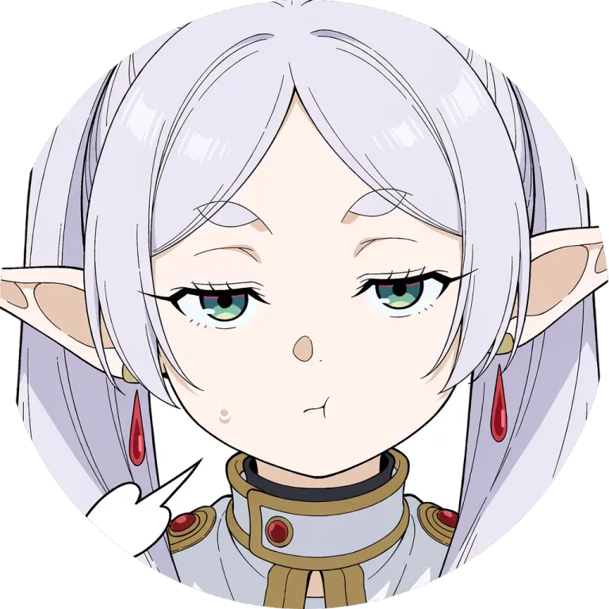

# LFU MCP

> Librechat Functional Utilities, LFU, or Elfu.

An MCP server of small utilities for Librechat.

## Tools

### `inline`

`inline` takes an `image_url`, follows redirects, and returns the image, downscaled and re-encoded to WebP.

This is useful for cases where the model has vision capability but only a URL. After inlining, in the same turn, a
Librechat agent/LLM can see the image.

#### What's the point of the `IMAGE_URL_MAP`?

If you are running other MCP that serve files but themselves are internally networked or not accessible by this MCP
because it's on a reverse proxy or some other reason, you need a way to translate those "public" URLs to internal ones.
This MCP defines a mapping environment variable that does this.

This also works with local images on disk if mapped, though you should be careful here; the MCP can enumerate and see
all files uploaded by any user to Librechat, for example, so make sure URL paths are unguessable.

### `time` and `since`

`time` returns the datetime. `since` takes a datetime and returns how long ago it was in human-readable form.

## Usage

Deploy as a Docker image:

```sh
docker run -d \
  -p 8080:8080 \
  -e API_KEY=change-me \
  -e PUBLIC_HOST=http://192.168.1.10:8080 \
  -e IMAGE_URL_MAP=https://chat.example.com/images/=/data/librechat-data \
  -e TZ=Australia/Sydney \
  -v /mnt/user/appdata/elfu-mcp:/data \
  -v /mnt/user/appdata/librechat/client/public/images:/data/librechat-data:ro \
  ghcr.io/wishmatic/elfu-mcp:latest
```

The MCP endpoint is served at `/mcp`; stored images are served from `/i/`.

See [.env.example](.env.example) for all configuration.

### Authentication

`API_KEY` is required on every `/mcp` request, sent as `Authorization: Bearer <API_KEY>`. Stored images are served
without authentication.

## License

Elfu MCP is licensed under the Apache License, Version 2.0. See [LICENSE](LICENSE).
