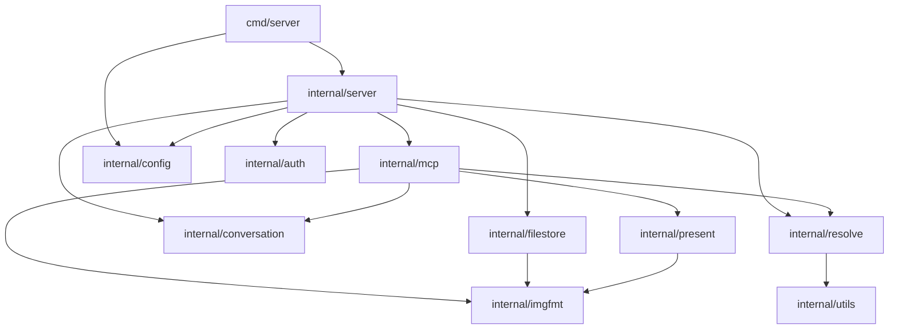

# Conversation files: `files` and `latest`

Status: Proposed
Depends on: none
Related: `docs/plans/done/BOOTSTRAP_PLAN.md`, `../neo-mcp`

## Goal

Add the two tools the project exists for, so an agent can look again at images that are already part of the
conversation:

- `files` returns every file in this conversation, oldest first, each inline as an MCP image block.
- `latest` returns the most recent file in this conversation, inline.

Both return real image content, not just links, because the reason to reach for them is that the model can no longer
see an image it was shown earlier: context was evicted, or the bytes were dropped between turns.

"The conversation" is the conversation the client names in its request headers, so a file's scope is what the user
would call the chat, not the MCP connection. That distinction matters: a connection can be reconnected, replaced, or
reused across chats within one client session.

## Non-goals

- Persisting conversation files to disk, or surviving a restart.
- Sharing files between users or conversations.
- Tracking files that `inline` did not produce. There is no generation tool, so `inline` is the only producer, and
  nothing else may add to this list.
- Changing `inline`'s inputs, description, schema, or content. It gains recording only.
- New configuration. The header names and the bounds below are constants.
- Storing conversation metadata in the file store or a database. The registry is in memory only.

## Design

### What counts as a file in the conversation

An image that `inline` successfully returned, recorded in call order. A URL that failed to download, or downloaded
but could not be encoded for the wire, is not a file: nothing was shown, so there is nothing to show again.
Re-inlining a URL does not create a second file, it refreshes the one entry (see below).

### What is recorded

The prepared image, not the download:

```go
type Entry struct {
	URL       string // exactly as passed to inline
	MediaType string // always image/webp today
	Data      []byte // the encoded bytes inline already produced
}
```

Recording the encoded bytes means `files` is a pure re-emission: no network, no decode, no re-encode, and the model
gets back byte-for-byte what it saw. It is also bounded by construction, since `imgfmt.Inline` already caps each
image at `InlineMaxBytes`. The alternatives are worse:

- recording the source URL and re-fetching at `files` time adds a failure mode (the URL may have rotted), can return
  different bytes than the model saw, re-runs the encoder on every call, and turns `files` into a repeatable
  server-side fetch of an arbitrary URL, which is an amplification of the SSRF surface `inline` already has;
- recording the raw download costs several times the memory (a source PNG can be 20 MB where the prepared WebP is
  200 KB) and re-encodes on every call.

### Scope: the conversation named in the request headers

The client sends the user ID and the conversation ID as request headers:

| Header                 | Meaning                                  |
| ---------------------- | ---------------------------------------- |
| `X-LC-User-Id`         | The user the conversation belongs to.    |
| `X-LC-Conversation-Id` | The conversation the request is part of. |

The `X-LC-` prefix is the client's, so these are simply the names it injects; they are constants in
`internal/mcp/scope.go` and are what LibreChat sends.

The SDK attaches the HTTP request headers to each request (`RequestExtra.Header`, populated for every JSON-RPC
request by the streamable HTTP transport), so a tool handler reads them from `req.Extra.Header` with no new
plumbing. Header lookup is case-insensitive, so the client's casing does not matter.

The registry is keyed by the pair:

```go
type Key struct {
	UserID         string
	ConversationID string
}
```

Both halves earn their place:

- The conversation ID is the scope the user means by "the conversation", and it is stable across reconnects, which
  is what makes `files` useful after a client restarts mid-chat.
- The user ID is defence in depth. The conversation ID is only a secret in the obscurity sense, and every client
  holds the same `API_KEY`, so ids are the only thing keeping one client out of another's files. Keying on the pair
  means a conversation ID that leaks on its own is not enough: a caller who does not also name the right user ID
  lands in a different bucket. A client whose user ID varies per connection would split its own files, which is a
  broken client rather than a design fault.

Because the conversation ID is a secret, it is treated as one: it is never logged, never echoed in tool output, never
put in an error message, and never used as a directory or file name. The user ID is not logged either. Tests assert
the conversation ID cannot reach the logs, in the same way the bootstrap asserts the API key cannot.

Accepted caveat: this is obscurity, not authorization. Anyone who knows a conversation ID and the matching user ID and
holds the shared API key can read that conversation's files. That is acceptable here, and the API key remains the
actual access control. This matches how the sibling `code-interpreter` service treats the same pair: it derives its
runtime session as a hash of tenant, user, and conversation hint, and documents that hint as never being a security
boundary.

Because those raw ids are secrets, the registry does not retain them. It stores entries under a digest of the key, so
the ids live no longer than the request that carried them and a process-lifetime map, heap dump, or log line cannot
be read back into a conversation ID. The digest is computed over the user ID and conversation ID with a separator,
so no pair of ids can collide by concatenation.

When the conversation header is absent, the call is scoped to the MCP session ID instead, which is what the previous
draft of this plan did unconditionally. That keeps clients that send no headers working rather than failing, and it
degrades to exactly today's behaviour rather than to something new. A missing header is logged once per process at
warn level, naming the header that is missing but never a value, so a client that forgets it is visible in logs
rather than silently scoped to the wrong thing. If the conversation header is present but the user header is absent,
the key simply has an empty user ID.

### Order, identity, and the `latest` invariant

- Files are ordered by when they were most recently shown. `files` returns oldest first, so the last element is the
  newest.
- Entries are identified by the URL as passed (trimmed of surrounding whitespace), so the same file passed twice is
  one file.
- Re-inlining a URL refreshes its bytes and moves it to the end, which keeps the invariant that the last element of
  `files` is always what `latest` returns. It also means "oldest" reads as "least recently shown", which is the useful
  order for a model deciding what to look at again.

### Bounds

Two controls, and nothing else:

| Bound                    | Value   | Rationale                                                                          |
| ------------------------ | ------- | ---------------------------------------------------------------------------------- |
| Entries per conversation | 50      | Bounds what a single `files` result can contain, which is a tool-response concern. |
| Total recorded bytes     | 256 MiB | Bounds process memory, which is the real constraint.                               |

The byte budget is enforced by evicting whole least-recently-used conversations, oldest first, when a `Record` would
exceed it. Evicting by conversation rather than by entry keeps the rule simple and keeps `latest` meaningful for the
conversations that survive. No single conversation can exceed a 50 MiB ceiling by construction (50 entries at
`InlineMaxBytes`), comfortably under the budget, so a conversation being written is never the one that has to be
evicted to make room.

There is deliberately no idle timeout and no session-based eviction. A conversation outlives the connection that
opened it, so tying eviction to connections would defeat the point, and a byte budget already reclaims whatever a
client abandons: an abandoned conversation is by definition the least recently used. Whatever it holds under an
unpressured budget is exactly what the budget says is affordable.

### Interfaces

`internal/conversation` is a new leaf package: standard library only, no SDK, no MCP types. It is the whole state
machine, so it is testable without a server. Its map is keyed by a digest of the user and conversation IDs, so no raw
id is retained.

```go
package conversation

type Key struct {
	UserID         string
	ConversationID string
}

type Entry struct {
	URL       string
	MediaType string
	Data      []byte
}

type Registry struct { /* unexported map keyed by a key digest, guarded by one mutex */ }

func New() *Registry

// Record stores entry under key, replacing an existing entry for the same URL and moving it to the end.
func (r *Registry) Record(key Key, entry Entry)

// Files returns this conversation's entries, oldest first. It returns a copy of the slice; Entry.Data is shared and
// must be treated as read-only.
func (r *Registry) Files(key Key) []Entry

// Latest returns the most recently recorded entry for this conversation.
func (r *Registry) Latest(key Key) (Entry, bool)
```

A zero `Key` is a valid key and shares one bucket, which is the honest behaviour when neither a conversation header
nor a session ID is available.

### MCP surface

`internal/mcp/files.go` registers both tools next to `inline`. Both take no inputs, so `InputSchema` is left nil and
the SDK infers an object schema from the handler's `struct{}` input, which is how the SDK's own examples do it.

| Tool     | Description                                                                                                                                                          |
| -------- | -------------------------------------------------------------------------------------------------------------------------------------------------------------------- |
| `files`  | List every file in this conversation, oldest first, returning each one inline as an MCP image block. Use it to see again an image shown earlier in the conversation. |
| `latest` | Return the most recent file in this conversation inline as an MCP image block. Use it to see the image you were last shown.                                          |

Content and structured output mirror `inline`'s shape, one text line per file immediately before its image:

- `files`: content is `[text(url), image, ...]` oldest first; output is `count` plus a `files` array of
  `{url, media_type, bytes}`.
- `latest`: content is the caption plus one image; output is `{url, media_type, bytes}`.
- An empty conversation is not an error: both return `count` 0 and a single text note saying the conversation has no
  files yet.
- Image blocks carry the same `[user, assistant]` audience as `inline`, which is what lets the model see them.

`inlineOutput` is left alone rather than shared, so the wholesale tool keeps its own types; the new tools use an
identical `fileOutput`.

Scope resolution lives in `internal/mcp/scope.go` as one function from a request to a `conversation.Key`, so all three
tools resolve scope the same way:

```go
func scopeKey(req *mcp.CallToolRequest) conversation.Key
```

### Presentation

`present.StoredImages` is not reusable here: it calls `imgfmt.Inline` on each input, which would decode and re-encode
bytes that are already prepared for the wire, losing quality and wasting CPU. `internal/present` therefore gains one
function that re-emits prepared images, keeping every user-visible string in the presentation layer:

```go
// PreparedImages presents images that are already prepared for the wire, one URL line immediately before each.
func PreparedImages(images []imgfmt.InlineImage, urls []string) []mcp.Content

// NoConversationFiles is the note returned when a conversation has no files yet.
func NoConversationFiles() []mcp.Content
```

`latest` reuses the existing `present.InlineImage`. `present` keeps importing only `imgfmt` and the SDK; the
`conversation.Entry` to `imgfmt.InlineImage` conversion happens in `internal/mcp`, which is the layer that knows both.

### Architecture impact



`AGENTS.md` must be updated with `conversation` and its two edges. The existing invariants hold: only
`internal/server` imports `internal/mcp`, `internal/present` never imports `internal/mcp`, and `internal/conversation`
joins `internal/utils` as a dependency-free leaf.

### Performance

- `Record` is O(n) for the move-to-end within a conversation (n <= 50) plus eviction, which is O(conversations) and
  only runs when the budget is exceeded.
- `files` is O(n) content assembly and does no image work at all.
- `latest` is O(1).
- A single mutex guards the registry; the critical sections are slice and map operations on small data.

## Implementation units

### Unit 1: the registry

Deliverables: `internal/conversation/registry.go`, `internal/conversation/registry_test.go`.

Acceptance criteria:

- [ ] `internal/conversation` imports only the standard library, verified with `go list -deps`.
- [ ] Recording A, B, C under one key gives `Files` = A, B, C and `Latest` = C.
- [ ] Re-recording A after A, B gives `Files` = B, A and `Latest` = A: refreshed bytes, original URL, no duplicate.
- [ ] Trimming makes `" url "` and `"url"` the same entry.
- [ ] Recording 51 entries keeps 50 and drops the oldest.
- [ ] Entries recorded under one key never appear under another, for keys that differ in either the user ID or the
      conversation ID.
- [ ] The registry retains no raw id: no stored key contains the conversation ID or the user ID as a substring.
- [ ] Keys cannot collide by concatenation, so `{UserID: "ab", ConversationID: "c"}` and
      `{UserID: "a", ConversationID: "bc"}` are separate conversations.
- [ ] A `Record` that would exceed the total byte budget evicts the least recently used conversation, and the evicted
      conversation's `Files` is then empty. The conversation being written survives.
- [ ] `Files` and `Latest` on an unknown key return an empty slice and `false`.
- [ ] Mutating the slice returned by `Files` does not affect the registry.
- [ ] Concurrent `Record`, `Files`, and `Latest` over many keys pass under `-race` with exact final counts.

### Unit 2: scope resolution and recording from `inline`

Deliverables: `internal/mcp/scope.go`, `internal/mcp/scope_test.go`, `internal/mcp/handlers.go`,
`internal/mcp/server.go`, `internal/mcp/inline.go`, `internal/mcp/inline_test.go`, `internal/server/server.go`.

Acceptance criteria:

- [ ] `mcp.Deps` gains `Registry *conversation.Registry`, defaulted to `conversation.New()` when nil, matching the
      existing defaulting style in `buildHandlers`.
- [ ] `server.New` builds one registry for the process and passes it to `mcp.New`.
- [ ] `scopeKey` reads `X-LC-User-Id` and `X-LC-Conversation-Id`, trims whitespace, resolves the names
      case-insensitively, and falls back to the session ID when `X-LC-Conversation-Id` is absent.
- [ ] `scopeKey` does not panic on a nil request, a nil `Extra`, or a nil session, since the existing direct-call test
      passes a nil request.
- [ ] `inline` records the prepared image under `scopeKey(req)`, and only after `imgfmt.Inline` succeeds; a fetch
      failure or an encode failure records nothing.
- [ ] `inline`'s name, description, schema, structured output, and content are byte-identical to the base, and its
      three existing tests pass unmodified.
- [ ] A test asserts two `inline` calls in one conversation leave two entries in call order, and a failed call leaves
      none.
- [ ] A test asserts the conversation ID and user ID appear in no log output, using the observer logger the base
      already uses for its API-key check.
- [ ] A request without `X-LC-Conversation-Id` logs exactly one warning naming that header, and the warning contains
      no header value.

### Unit 3: the `files` and `latest` tools

Deliverables: `internal/mcp/files.go`, `internal/mcp/files_test.go`, `internal/present/image.go`,
`internal/present/image_test.go`, `internal/mcp/server_test.go`, `internal/server/http_test.go`.

Acceptance criteria:

- [ ] `tools/list` is exactly `["files", "inline", "latest"]`, and registers none of them when no resolver is
      configured. This intentionally replaces the bootstrap's one-tool guarantee.
- [ ] Both tools advertise a no-argument object input schema and are callable with empty arguments.
- [ ] After two inlines, `files` content is `[text(url1), image, text(url2), image]`, its output `count` is 2, and its
      `files` array lists both URLs oldest first.
- [ ] `latest` returns the second image with both audiences set, and its output matches that file's
      `{url, media_type, bytes}`.
- [ ] The image bytes returned by `files` are byte-identical to the bytes `inline` returned for the same URL, proving
      nothing is re-encoded.
- [ ] With no files, both tools return `count` 0, a single text note, and `IsError` false.
- [ ] Over HTTP, two clients with the same conversation header but different sessions share one file list, which is
      the behaviour that distinguishes conversation scope from session scope.
- [ ] Over HTTP, one client session using two different conversation headers sees two isolated file lists, and a
      request with no conversation header is scoped to its session and does not see the conversation's files.
- [ ] `present` still imports only `imgfmt` and the SDK, verified with `go list -deps`.
- [ ] `go build ./...`, `go vet ./...`, and `go test ./... -race -count=1` pass.

### Unit 4: documentation and real-client verification

Deliverables: `AGENTS.md`, `README.md`.

Acceptance criteria:

- [ ] `AGENTS.md`'s diagram includes `internal/conversation` and both edges, checked against `go list` output.
- [ ] `README.md` lists the three tools, names `X-LC-User-Id` and `X-LC-Conversation-Id`, and states that a file's
      scope is the conversation the client names, falling back to the MCP session.
- [ ] Human check: from a real MCP client, inline two images, then call `files` and confirm the model can see both,
      oldest first, and that `latest` returns the second.
- [ ] Human check: reconnect or restart the client mid-conversation and confirm `files` still returns the
      conversation's images. This is what proves the header's scope is stable where a session ID would not be.
- [ ] Human check: start a new conversation and confirm `files` returns the empty-conversation note, and that
      returning to the earlier conversation returns its files again.

## Verification

Per unit, `go build ./...`, `go vet ./...`, and `go test ./... -race -count=1`. Unit 2's requirement that `inline` is
untouched is checked by diffing it against `neo-mcp`, as the bootstrap did. Unit 3's header tests are the ones that
prove the SDK's header plumbing reaches a tool handler at all, which everything else here depends on. The criteria
that carry the design are the `latest` invariant, conversation isolation, and the stability of scope across
reconnects.
