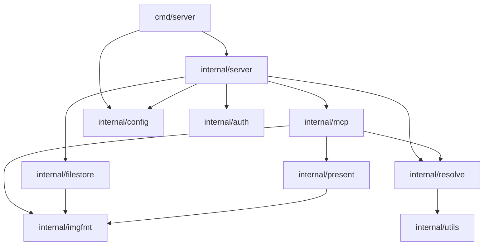

# Bootstrap

Status: Done
Depends on: none
Related: `../neo-mcp` (source of every copied file)

## Goal

Stand up `elfu-mcp` as a deployable MCP server that exposes exactly one tool, `inline`, taken wholesale from
`neo-mcp`: same name, description, input schema, structured output, caption text, audience, and the same WebP
downscale and re-encode path capped at 1024px and 1 MiB.

The server also serves its file store at `/i/*`, so a URL it hands out (or one on the same `PUBLIC_HOST`) can be fed
back to `inline` and read straight from disk rather than over the network.

Two further tools, `files` (every file so far in the conversation, oldest first) and `latest` (the newest), are the
reason this project exists but are **not** part of this plan. The bootstrap must not preclude them.

## Non-goals

- Implementing `files` or `latest`.
- Image generation, `bgkill`, `anlas`, NovelAI, SD WebUI Forge, upload and publishing. The `format` tool input and
  `OUTPUT_FORMAT`, `ERROR_DETAIL`, `SD_URL`, and `NOVELAI_API_KEY` go with them; `inline` is always WebP by
  construction.
- Any new tool, prompt, or resource. After this plan a deployed server lists one tool.
- Persisting, indexing, or tracking inlined images.

## Design

### Base

Everything is copied from `neo-mcp` at commit `fdc5359` (Support SSE framing in NovelAI stream decoder), whose
`internal/present` package had just consolidated MCP image content. Every copied file was verified with `diff`
against that commit; the only differences are the intentional ones named below. `neo-mcp` is under active
development, so this was re-checked once the base moved, and the copies needed no resync.

Module path is `github.com/wishmatic/elfu-mcp`, matching the `origin` remote. The resolver's `User-Agent` names
`elfu-mcp` and its own repository, since that is the identity sites actually see.

### Toolchain

`go.mod` declares `go 1.27.0` and `go.sum` is regenerated with `go mod tidy` rather than copied, so the dependency
set is exactly what the final tree imports.

`.prototools` pins `go = "1.27.1"` and is load-bearing: `go` on `PATH` is the proto shim, which resolves a toolchain
per directory. Without that file the repo resolves Go 1.26.5, which cannot build a `go 1.27.0` module.

### Scope of what was copied

| Disposition                              | Packages and files                                                                                                                                                                                                                                                         |
| ---------------------------------------- | -------------------------------------------------------------------------------------------------------------------------------------------------------------------------------------------------------------------------------------------------------------------------- |
| Copied verbatim (import paths rewritten) | `internal/auth`, `internal/utils`, `internal/imgfmt`, `internal/resolve`, `internal/filestore`, `internal/present/{image,image_test}.go`, `internal/mcp/{inline,inline_test,session_test}.go`, `cmd/server/main.go`                                                        |
| Copied, trimmed                          | `internal/config` (keeps `Host`, `Port`, `LogLevel`, `APIKey`, `PublicHost`, `FilesDir`)                                                                                                                                                                                   |
| Copied, reduced                          | `internal/mcp`: `handlers.go` is now `log` + `resolver`; `server.go` registers only `inline`; `server_test.go` covers the new tool set                                                                                                                                     |
| Written                                  | `internal/mcp/testhelpers_test.go`, `internal/server/{server,server_test}.go`, `README.md`, `.env.example`, this plan                                                                                                                                                      |
| Not copied                               | `internal/imagegen`, `internal/bgkill`, `internal/crop`, `internal/novelai`, `internal/sdwebui`, `internal/publish`; `internal/mcp/{anlas,bgkill,format,generation,img2img,publish,publisher,provider,shared,txt2img}*.go`; `internal/present/anlas*.go`; `docs/PROMPT.md` |

The library packages are copied whole, including the parts no remaining tool calls:

- `imgfmt.Convert`, which is dead once generation is gone but shares `encodeQuality` and the format registry with
  `inline.go`;
- `filestore.UploadFile` and `objectKey`, which nothing calls because nothing uploads, but which its own tests use to
  cover the key and path safety that also protects `GetObject`;
- `resolve.Resolve` and `input.go`, since `inline` only needs `Fetch`;
- `present.StoredImages`, which pairs stored URLs with their inline images and is the natural base for `files`.

Keeping these means the copied packages stay diff-clean against `neo-mcp`, which keeps future ports cheap, and leaves
the substrate `files` and `latest` will need. Trimming them is a separate, defensible change on its own merits.

### Tool surface

`registerTools` keeps its base shape, so the guard is the only condition:

```go
func registerTools(srv *mcp.Server, h *handlers) {
	if h.resolver != nil {
		registerInline(srv, h)
	}
}
```

`server.New` always builds a resolver, so a deployed instance always lists exactly `["inline"]`, and `Deps{}` still
yields zero tools, which keeps the empty case testable.

### Package graph

`AGENTS.md` was updated to match:



The existing invariant survives: only `internal/server` imports `internal/mcp`; `internal/present` may import the MCP
SDK but never `internal/mcp`; `internal/utils` is the dependency-free leaf.

### Configuration

| Envar         | Default   | Meaning                                                                  |
| ------------- | --------- | ------------------------------------------------------------------------ |
| `HOST`        | `0.0.0.0` | Listen address.                                                          |
| `PORT`        | `8080`    | Listen port.                                                             |
| `LOG_LEVEL`   | `info`    | zap level.                                                               |
| `API_KEY`     | unset     | Required. Bearer token on every `/mcp` request.                          |
| `PUBLIC_HOST` | unset     | Required. Absolute base URL; URLs under it are read from the file store. |
| `FILES_DIR`   | `files`   | Object tree root; `/data/files` in Docker.                               |

`PUBLIC_HOST` and `FILES_DIR` are required because the file-serving surface is part of this plan: the server must
serve `/i/*` and must resolve its own URLs without a network round trip.

### Forward compatibility for `files` and `latest`

There are no generation tools, so the only thing that can populate a conversation is `inline` itself: "files so far in
the conversation" means the images `inline` has handed back, oldest first. Three things follow, none built here:

1. Scope is the MCP session. `mcp.CallToolRequest.Session` is a `*ServerSession` and `Session.ID()` is available, so a
   per-conversation registry keys off `req.Session.ID()`. `inline` keeps its `_ *mcp.CallToolRequest` parameter for
   exactly this reason.
2. A registry is the only source of truth. Inlined bytes are never stored, so `files` and `latest` cannot be derived
   from `FILES_DIR`; the registry either holds the fetched bytes in memory per session or holds source URLs and
   re-fetches them. That is a decision for the next plan.
3. The plumbing already fits. `handlers.resolver` is the re-fetch path and `present.StoredImages` already renders URLs
   alongside their inline images.

## Implementation units

### Unit 1: repository scaffold and toolchain

Deliverables: `.prototools`, `go.mod`, `go.sum`, `.gitignore`, `.dockerignore`, `LICENSE`, `renovate.json`,
`Dockerfile`, `.github/workflows/ci.yml`, `.env.example`, `AGENTS.md`, `README.md`, `docs/plans/README.md`,
`docs/plans/done/.gitkeep`, `docs/learnings/.gitkeep`.

Acceptance criteria:

- [x] `go version` inside the repo prints `go1.27.1`, proving `.prototools` resolves the toolchain.
- [x] `go mod tidy` exits 0 and leaves no dependency the tree does not import.
- [x] `.dockerignore` excludes `.env` and `.env.*` except `.env.example`.
- [x] `Dockerfile` builds `./cmd/server` as a static binary running as uid 65532 with `/data` owned by it.
- [x] CI runs `go build ./...`, `go vet ./...`, and `go test ./... -race -count=1`, and its publish job targets
      `ghcr.io/${{ github.repository }}`.

### Unit 2: shared libraries

Deliverables: `internal/imgfmt`, `internal/resolve`, `internal/filestore`, `internal/utils`, `internal/auth`,
`internal/present`, and `internal/config` with their tests.

Acceptance criteria:

- [x] `go build ./...`, `go vet ./...`, and `go test ./... -race -count=1` pass.
- [x] `neo-mcp` appears nowhere in any Go source file.
- [x] No file in these packages imports a package left behind in `neo-mcp`.
- [x] `internal/config` parses only the six envars in the table above, with defaults and `PublicBase()` validation
      covered by tests.
- [x] `resolve.Resolver.Fetch` still reads `PUBLIC_HOST` URLs from the store; the test covering that path is unchanged
      from the base.
- [x] `internal/utils` imports nothing from the module.

### Unit 3: the MCP surface and file serving

Deliverables: `internal/mcp/{inline,handlers,server}.go` with `{inline,session,server,testhelpers}_test.go`,
`internal/server/{server,server_test}.go`, `cmd/server/main.go`.

Acceptance criteria:

- [x] `go build ./...`, `go vet ./...`, and `go test ./... -race -count=1` pass.
- [x] A test asserts the tool list is exactly `["inline"]` with a resolver configured, and empty without one.
- [x] `inline`'s tool name, description, schema field docs, output tags, and caption text are unchanged from the base,
      and its three tests carry over unmodified.
- [x] `internal/mcp` and `internal/server` contain no reference to generation, publishing, or `format`.
- [x] The server refuses to start without `API_KEY`, without `PUBLIC_HOST`, and without `FILES_DIR`.
- [x] `/healthz` returns `ok`, a stored file is served from `/i/*` with its content type and an immutable
      `Cache-Control`, an unknown key is a 404, and `/mcp` is 401 without a bearer token.
- [x] Driving the real router over HTTP with a real MCP client, `tools/list` is exactly `["inline"]`, and a
      `tools/call` for an external image URL returns a caption plus a decodable WebP image block. This covers
      `internal/server/http_test.go`.
- [x] A URL on the server's own `PUBLIC_HOST` is read from the file store rather than over the network: with a
      `PUBLIC_HOST` that cannot resolve, `inline` still succeeds against a stored file.

### Unit 4: documentation

Deliverables: `README.md`, `AGENTS.md`, `.env.example` as listed in Unit 1.

Acceptance criteria:

- [x] `README.md` is short and high level: what the server is, the one tool, deployment, the envars, `API_KEY` auth on
      `/mcp`, and the Apache-2.0 license with its derivation from `neo-mcp`.
- [x] `AGENTS.md`'s diagram matches the real import graph, checked against imports rather than by hand.
- [x] `.env.example` lists exactly the six envars `config` reads.

### Unit 5: deployment verification

The container checks need a Docker socket this environment cannot reach, since the user running it is not in the
`docker` group. The behaviour they would cover is already asserted over HTTP by `internal/server/http_test.go`, so
what remains is confirming the image itself builds and boots.

Acceptance criteria:

- [ ] Human check: `docker build` succeeds, and a container started with `API_KEY` and `PUBLIC_HOST` answers `/healthz`
      with `ok` and lists one tool at `/mcp`.
- [ ] Human check: from a real MCP client, the model can read an image returned by `inline`.

## Verification

Per unit, `go build ./...`, `go vet ./...`, and `go test ./... -race -count=1`, plus a grep that no dropped concept
survives. The acceptance criterion that matters most is the tool-list assertion, because "zero tools except `inline`"
is the point of this bootstrap and is otherwise easy to regress silently.
